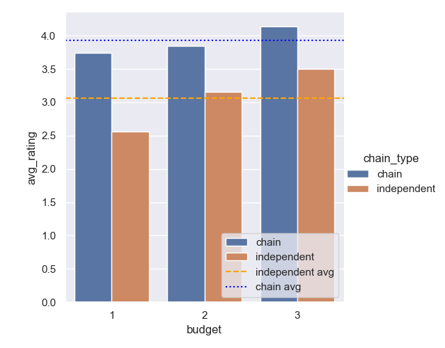

**Navigation:**

[1. Budget categories]()\
[2. Cuisines](./analysis_cuisines.md)\
[3. Pricing](./analysis_pricing.md)

## 1. Budget categories

Budget categories are labelled as follows:
- 1 -> low budget
- 2 -> mid-budget
- 3 -> high budget

**First we look at the relationship between budget categories and number of restaurants, user rating, review counts.**

```sql
-- Q1
SELECT 
	budget, 
	COUNT(*) AS rest_count,
	AVG(rating)::NUMERIC(3,2) AS avg_rating,
	AVG(review_number)::INT AS avg_review_count
FROM restaurant
GROUP BY budget
ORDER BY budget;
```

Query result:

| budget | rest_count | avg_rating | avg_review_count |
| ------ | ---------- | ---------- | ---------------- |
| 1      | 71         | 3.49       | 1745             |
| 2      | 134        | 3.70       | 2026             |
| 3      | 92         | 4.07       | 1685             |


There is a positive correlation between budget categories and user ratings. Restaurants belonging to higher budget category have higher average ratings than their lower counterparts.

When it comes to review count, mid-budget restaurants have the highest number of reviews (2026), followed by low-budget (1745) and high-budget restaurants (1685). It indicates that mid-budget restaurants have the most sales. Lower budget restaurants have the 2nd highest sales and high budget ones have the lowest sales, although by a small margin.

Mid-budget restaurants are the highest in number, having 134 out of 298 restaurants.

**Now let's take a more detailed look into the average rating of each budget category by only considering restaurants with a higher number of reviews.**

```sql
-- Q2
WITH gt100 AS 
(
	SELECT 
		budget, 
		AVG(rating)::NUMERIC(3,2) AS avg_rating
	FROM restaurant
	WHERE review_number > 100
	GROUP BY budget
),
gt1000 AS
(
	SELECT 
		budget, 
		AVG(rating)::NUMERIC(3,2) AS avg_rating
	FROM restaurant
	WHERE review_number > 1000
	GROUP BY budget
)
SELECT 
	gt100.budget, 
	gt100.avg_rating AS avg_rating_gt_100,
	gt1000.avg_rating AS avg_rating_gt_1000
FROM gt100 INNER JOIN gt1000 USING (budget)
ORDER BY budget
```

Result:

| budget | avg_rating_gt_100 | avg_rating_gt_1000 |
| ------ | ----------------- | ------------------ |
| 1      | 3.72              | 3.65               |
| 2      | 3.90              | 3.98               |
| 3      | 4.14              | 4.22               |


To calculate average ratings of each budget category, we only include restaurants with over (i) 100 and (ii) 1000 reviews. This ensures that new or unpopular restaurants do not affect the average rating.

At a higher level, the result still shows a positive correlation between user ratings and budget category. Comparing the average ratings of all restaurants (from previous query) to cases (i) and (ii) reveals some interesting facts.

In low budget restaurants, average rating improved significantly when we considered restaurants with over 100 reviews. But when we considered restaurants with over 1000 reviews, the average rating dipped slightly. One explanation could be low budget restaurants do not start strong. But as they gain some popularity, their rating goes up. When gaining significant popularity, their quality downgrades which lead to a dip in the user ratings.

In mid-budget restaurants, average rating increases when we filter out new and unpopular restaurants. The average rating keeps on increasing as we only consider the most popular mid-budget restaurants. It reveals that restaurants in this budget category tend to maintain their reputation as they gain popularity.

In high budget restaurants, average rating increases as we move from all restaurants to over 100 and 1000 reviews. However, the growth is stable and there isn't a significant difference. It reveals that high budget restaurants have the most stable and high user ratings.

**Now let's take a look at how budget categories affect inclusion of VAT in food prices.**

```sql
-- Q3
SELECT 
	budget,
	is_vat_included,
	(COUNT(*) * 100 / SUM(COUNT(*)) OVER (PARTITION BY budget))::NUMERIC(4,2) 
		AS rest_percentage
FROM restaurant
GROUP BY budget, is_vat_included
ORDER BY budget, is_vat_included;
```

Result:

| budget | is_vat_included | rest_percentage |
| ------ | --------------- | --------------- |
| 1      | False           | 7.04            |
| 1      | True            | 92.96           |
| 2      | False           | 29.10           |
| 2      | True            | 70.90           |
| 3      | False           | 43.48           |
| 3      | True            | 56.52           |


For all budget categories, more restaurants include VAT in their prices than exclude. As restaurants go up the budget category, they have a higher tendency to exclude vat from food prices.

One reason could be that the high budget restaurants want to display the prices (which is already high) lower than the actual price to attract more customers.

**Budget categories also play role in a restaurant being a super vendor.**

```sql
-- Q4
SELECT 
	budget,
	is_super_vendor,
	(COUNT(*) * 100 / SUM(COUNT(*)) OVER (PARTITION BY budget))::NUMERIC(4,2) 
		AS rest_percentage
FROM restaurant
GROUP BY budget, is_super_vendor
ORDER BY budget, is_super_vendor;
```

Result:

| budget | is_super_vendor | rest_percentage |
| ------ | --------------- | --------------- |
| 1      | False           | 90.14           |
| 1      | True            | 9.86            |
| 2      | False           | 82.84           |
| 2      | True            | 17.16           |
| 3      | False           | 64.13           |
| 3      | True            | 35.87           |


Higher budget categories have a higher percentage of super vendors than their lower counterparts.  High budget restaurants have better and more stable ratings, which might be a factor in increasing their chances of being a super vendor.

Apart from restaurants, we also have: 
- street food vendors
- home kitchens

**Let's see the percentage of them for each budget category.**

```sql
-- Q5
SELECT 
	budget,
	vertical_segment,
	(COUNT(*) * 100 / SUM(COUNT(*)) OVER (PARTITION BY budget))::NUMERIC(4,2) 
		AS rest_percentage
FROM restaurant
GROUP BY budget, vertical_segment
ORDER BY budget, vertical_segment;
```

Result:

| budget | vertical_segment   | rest_percentage |
| ------ | ------------------ | --------------- |
| 1      | home_based_kitchen | 21.13           |
| 1      | restaurants        | 78.87           |
| 2      | home_based_kitchen | 8.96            |
| 2      | restaurants        | 89.55           |
| 2      | street_food        | 1.49            |
| 3      | home_based_kitchen | 1.09            |
| 3      | restaurants        | 98.91           |


There is a higher percentage of home kitchens (21%) in the low-budget category than in mid-budget (9%), and almost negligible percentage in the high budget category (1%). Moreover, street foods only belong to the mid-budget category.

There are 2 types of restaurants:
- chain (they have multiple branches)
- independent (only present in a single locality)

**We take a look at how budget categories and being chain/independent restaurant effect rating.**

```sql
-- Q6
SELECT 
	budget,
	(CASE 
		WHEN chain_main_vendor_code IS NULL THEN 'independent' ELSE 'chain'
	END) AS chain_type,
	AVG(rating)::NUMERIC(3,2) as avg_rating
FROM restaurant
GROUP BY budget, chain_type
ORDER BY budget, chain_type;
```

Result:

| budget | chain_type  | avg_rating |
| ------ | ----------- | ---------- |
| 1      | chain       | 3.74       |
| 1      | independent | 2.56       |
| 2      | chain       | 3.85       |
| 2      | independent | 3.16       |
| 3      | chain       | 4.14       |
| 3      | independent | 3.50       |



Chain restaurants have significantly better average rating than independent restaurants. It suggests that established restaurants with more resources offer better service in general.

Average rating of low budget chain restaurants (3.7) are higher than low budget average rating (3.5). But low budget independent restaurants have significantly worse average rating (2.56), which is rather concerning.

The same trend applies for mid-budget restaurants. Average rating of chain restaurants (3.85) are better than mid-budget average (3.7), but mid-budget independent restaurants have significantly lower average rating (3.16).

High budget restaurants are in a similar position. Their average rating (4.0) is close to that of high budget chain restaurants (4.1). High budget independent restaurants have average rating (3.5) equal to the average rating of low budget restaurants.
