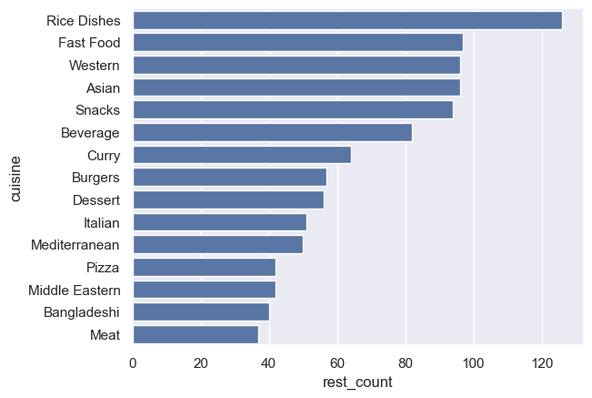
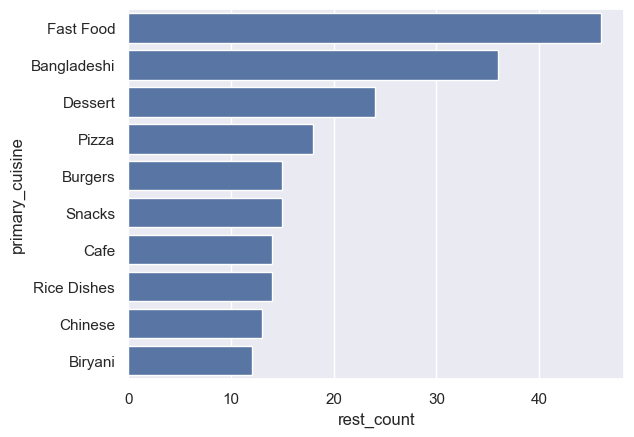
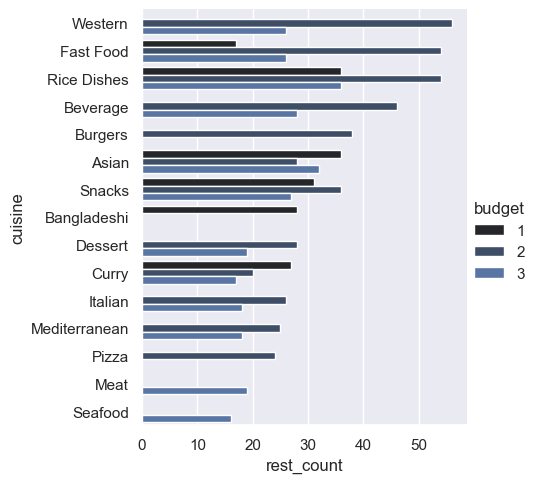
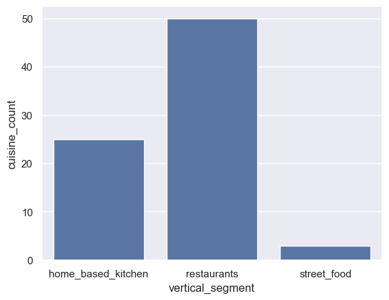
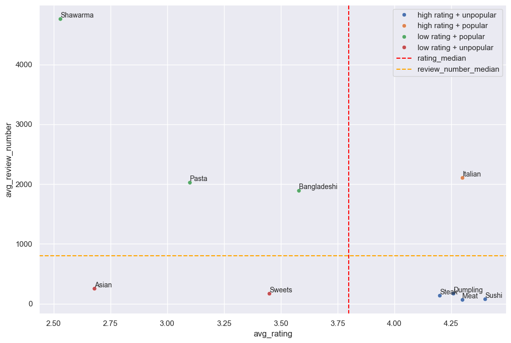

**Navigation:**

[1. Budget categories](./analysis_budget_categories.md)\
[2. Cuisines]()\
[3. Pricing](./analysis_pricing.md)

## 2. Cuisines

In our data, each restaurant serves multiple cuisines, with 1 cuisine being the primary one, and (eventually) one cuisine is served by many restaurants. So there is a many-to-many relationship between restaurants and cuisines.

**First we find out which cuisines are served by most restaurants.**

```sql
-- Q7
WITH cui_rest_count AS (
	SELECT 
		cui_id, 
		COUNT(DISTINCT rest_code) AS rest_count
	FROM cui_rest_dim
	GROUP BY cui_id
)
SELECT 
	cui.cui_name AS cuisine,
	crc.rest_count AS rest_count
FROM cui_rest_count AS crc INNER JOIN cuisines AS cui USING (cui_id)
ORDER BY rest_count DESC
LIMIT 15;
```

Result:

| cuisine        | rest_count |
| -------------- | ---------- |
| Rice Dishes    | 126        |
| Fast Food      | 97         |
| Western        | 96         |
| Asian          | 96         |
| Snacks         | 94         |
| Beverage       | 82         |
| Curry          | 64         |
| Burgers        | 57         |
| Dessert        | 56         |
| Italian        | 51         |
| Mediterranean  | 50         |
| Pizza          | 42         |
| Middle Eastern | 42         |
| Bangladeshi    | 40         |
| Meat           | 37         |



Rice dishes is the most widely available cuisine, offered by more than 1/3rd of the restaurants. Fast food and Western cuisines occupy the 2nd and 3rd place in the top cuisines list. Asian cuisine is a close 4th, indicating that Western and Asian foods are in popularity.

Presence of snacks and beverages in the top cuisines indicate that most restaurants offer them alongside their main cuisines.

Italian, Mediterranean, and Middle Eastern cuisines are also present in the top 15 cuisines, meaning they have a decent customer base in Dhaka.

Burger, pizza, curry, and dessert are also present in the top cuisines list. Bangladeshi cuisine is at the lower part of the list, ascertaining that restaurants have lower tendency to serve Bengali food alongside other items.

**Instead of taking a look at the cuisines offered by restaurants, we now focus on the primary cuisine of the restaurants.**

```sql
-- Q8
SELECT 
	cui.cui_name as primary_cuisine,
	COUNT(*) as rest_count
FROM restaurant as rest 
INNER JOIN cuisines as cui 
ON rest.primary_cuisine_id = cui.cui_id
GROUP BY cui.cui_id
ORDER BY rest_count DESC
LIMIT 10;
```

Result:

| primary_cuisine | rest_count |
| --------------- | ---------- |
| Fast Food       | 46         |
| Bangladeshi     | 36         |
| Dessert         | 24         |
| Pizza           | 18         |
| Burgers         | 15         |
| Snacks          | 15         |
| Cafe            | 14         |
| Rice Dishes     | 14         |
| Chinese         | 13         |
| Biryani         | 12         |



Fast food restaurants are the highest in number, followed by Bangladeshi and dessert restaurants. Pizza, burger, Chinese, and biryani restaurants are also available in great numbers.

Once again, we see Western and Asian cuisines dominating the top cuisines list. Snack shops and cafes are also quite abundant.

Finally, rice dishes and biryani cuisines make it to the top. The results are consistent with the list of top cuisines offered by all restaurants.

**Now let's break down the cuisines into budget categories to figure out how it affects the number of restaurants serving a cuisine.**

```sql
-- Q9
SELECT 
	rest.budget AS budget,
	cui.cui_name AS cuisine,
	COUNT(crd.rest_code) AS rest_count
FROM cui_rest_dim AS crd 
INNER JOIN cuisines AS cui USING (cui_id)
INNER JOIN restaurant AS rest USING (rest_code)
GROUP BY budget, cuisine
ORDER BY rest_count DESC
LIMIT 30;
```

Result:

| budget | cuisine           | rest_count |
| ------ | ----------------- | ---------- |
| 2      | Western           | 56         |
| 2      | Fast Food         | 54         |
| 2      | Rice Dishes       | 54         |
| 2      | Beverage          | 46         |
| 2      | Burgers           | 38         |
| 1      | Asian             | 36         |
| 1      | Rice Dishes       | 36         |
| 2      | Snacks            | 36         |
| 3      | Rice Dishes       | 36         |
| 3      | Asian             | 32         |
| 1      | Snacks            | 31         |
| 1      | Bangladeshi       | 28         |
| 2      | Asian             | 28         |
| 3      | Beverage          | 28         |
| 2      | Dessert           | 28         |
| 3      | Snacks            | 27         |
| 1      | Curry             | 27         |
| 3      | Fast Food         | 26         |
| 3      | Western           | 26         |
| 2      | Italian           | 26         |
| 2      | Mediterranean     | 25         |
| 2      | Pizza             | 24         |
| 2      | Curry             | 20         |
| 3      | Meat              | 19         |
| 3      | Dessert           | 19         |
| 3      | Italian           | 18         |
| 3      | Mediterranean     | 18         |
| 1      | Fast Food         | 17         |
| 3      | Curry             | 17         |
| 3		 | Seafood			 | 16 		  |



Dividing the top cuisines list for each budget category, we see that rice dishes are consistently popular among all budget categories, with mid-budget offerings being the most popular.

Mid-budget Western, fast food, and burger options dominate the top of the list. Low or high budget burger options are absent in the list, although high budget Western and fast food options are present.

Asian cuisine is present predominantly in the list, with low budget offerings being at the top. Then comes high budget Asian offerings, followed by mid-budget options. It reveals that customers tend to go for either cheap or expensive Asian food items rather than going down the middle of the budget.

Mid-budget Italian, pizza, and Mediterranean cuisines also make it to the list. High budget Mediterranean options are also popular.

Low budget Bangladeshi options are present at the top half of the list, indicating their availability.

**Now we want to find out the relationship between budget categories and the number of cuisine offered.**

```sql
-- Q10
SELECT 
	rest.budget AS budget,
	COUNT(DISTINCT cui.cui_id) AS cuisine_count
FROM cui_rest_dim AS crd 
INNER JOIN cuisines AS cui USING (cui_id)
INNER JOIN restaurant AS rest USING (rest_code)
GROUP BY budget
ORDER BY budget;
```

Result:

| budget | cuisine_count |
| ------ | ------------- |
| 1      | 38            |
| 2      | 43            |
| 3      | 49            |


As we go up the budget categories, we see an increase in the number of cuisines available. Higher budget categories offer more diverse cuisines.

**We want to know how diverse are home kitchens and street food vendors in terms of cuisines offered.**

```sql
-- Q11
SELECT 
	rest.vertical_segment AS vertical_segment,
	COUNT(DISTINCT cui.cui_id) AS cuisine_count
FROM cui_rest_dim AS crd 
INNER JOIN cuisines AS cui USING (cui_id)
INNER JOIN restaurant AS rest USING (rest_code)
GROUP BY vertical_segment;
```

Result:

| vertical_segment   | cuisine_count |
| ------------------ | ------------- |
| home_based_kitchen | 25            |
| restaurants        | 50            |
| street_food        | 3             |



Among restaurants, home kitchens, and street food vendors, restaurants offer the most diverse types of food, as expected. They offer 50 cuisines. Home kitchens offer half the number of cuisines (25), while street food vendors only offer 3.

Though home kitchens are a relatively new concept in food delivery apps, they are getting more diverse.

**Now let's check which primary cuisines are liked by customers.**

```sql
-- Q12

-- top 10
SELECT 
	cui.cui_name as primary_cuisine,
	AVG(rest.rating)::NUMERIC(3,2) as avg_rating
FROM restaurant as rest 
INNER JOIN cuisines as cui 
ON rest.primary_cuisine_id = cui.cui_id
GROUP BY cui.cui_id
ORDER BY avg_rating DESC
LIMIT 10;

-- bottom 10
SELECT 
	cui.cui_name as primary_cuisine,
	AVG(rest.rating)::NUMERIC(3,2) as avg_rating
FROM restaurant as rest 
INNER JOIN cuisines as cui 
ON rest.primary_cuisine_id = cui.cui_id
GROUP BY cui.cui_id
ORDER BY avg_rating 
LIMIT 10;
```

Results:

1. 1st result

| primary_cuisine | avg_rating |
| --------------- | ---------- |
| Juice Corner    | 4.44       |
| Sushi           | 4.40       |
| Italian         | 4.30       |
| Meat            | 4.30       |
| Dumpling        | 4.26       |
| Cafe            | 4.22       |
| Cakes           | 4.20       |
| Steak           | 4.20       |
| Mexican         | 4.15       |
| Seafood         | 4.10       |

2. 2nd result

| primary_cuisine   | avg_rating |
| ----------------- | ---------- |
| Shawarma          | 2.53       |
| Asian             | 2.68       |
| Chotpoti & Fuchka | 3.00       |
| Pasta             | 3.10       |
| Sandwiches        | 3.30       |
| Wraps             | 3.40       |
| Sweets            | 3.45       |
| Snacks            | 3.51       |
| Bangladeshi       | 3.58       |
| Kebab             | 3.60       |

Asian items like sushi and dumpling seem to be popular and well accepted options, along with Mexican and Italian cuisines.

It is interesting to note that juice corners, cafes, and bakeries have high user ratings. Meat and steak restaurants are also doing quite well. Most of these cuisines are not served by a lot of restaurants, indicating that the few ones serving them have high ratings.

In the list of lowest rated cuisines, we see many popular options. Most of these cuisines are relatively cheaper, like shawarma, snacks, chotpoti-fuchka, sandwiches, and wraps. These cuisines mostly belong to low budget category, which also have low ratings.

The presence of Asian cuisine seems a bit confusing, as Asian items like dumplings and sushi are highly rated. The reason could be that few niche restaurants specializing in items like sushi and dumplings are doing well, and the rest which are focusing on the entire Asian menu are doing poor.

Though cafes and bakeries are doing well, sweet vendors are getting low ratings. It indicates that most sweet shops tend to sell average or sub-par quality sweets.

**Using the review numbers, we can take a guess at the popularity of a primary cuisine.**

```sql
-- Q13

-- top 10
SELECT 
	cui.cui_name as primary_cuisine,
	AVG(rest.review_number)::INT as avg_review_number
FROM restaurant as rest 
INNER JOIN cuisines as cui 
ON rest.primary_cuisine_id = cui.cui_id
GROUP BY cui.cui_id
ORDER BY avg_review_number DESC
LIMIT 10;

-- bottom 10
SELECT 
	cui.cui_name as primary_cuisine,
	AVG(rest.review_number)::INT as avg_review_number
FROM restaurant as rest 
INNER JOIN cuisines as cui 
ON rest.primary_cuisine_id = cui.cui_id
GROUP BY cui.cui_id
ORDER BY avg_review_number 
LIMIT 10;
```

Results:

1. 1st result:

| primary_cuisine | avg_review_number |
| --------------- | ----------------- |
| Biryani         | 6906              |
| Shawarma        | 4761              |
| Fried Chicken   | 4610              |
| Burgers         | 3881              |
| Fast Food       | 2441              |
| Pizza           | 2111              |
| Italian         | 2104              |
| Rice Dishes     | 2038              |
| Pasta           | 2025              |
| Bangladeshi     | 1889              |

2. 2nd result

| primary_cuisine | avg_review_number |
| --------------- | ----------------- |
| Noodles         | 34                |
| Middle Eastern  | 41                |
| Meat            | 64                |
| Sushi           | 75                |
| Curry           | 91                |
| Western         | 119               |
| Steak           | 134               |
| Sweets          | 167               |
| Dumpling        | 168               |
| Asian           | 251               |

Average review numbers give an idea about the sales figures or popularity of the cuisine.

It is quite evident that rice and meat-based items from Indian and Western origin (biryani, fried chicken, burgers, rice dishes), as well as some Italian items like pizza, pasta are in high demand.

Cuisines with lowest average review number consists of some niche options like sushi, steak, noodles, and dumpling. Middle Eastern, Western, and Asian cuisines are present in the list.

**Combining the above two results, we can come up with the following graph:**


