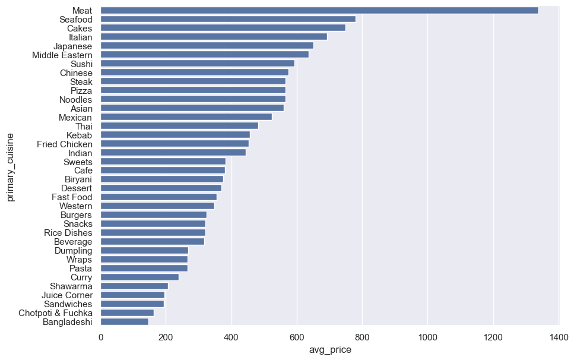
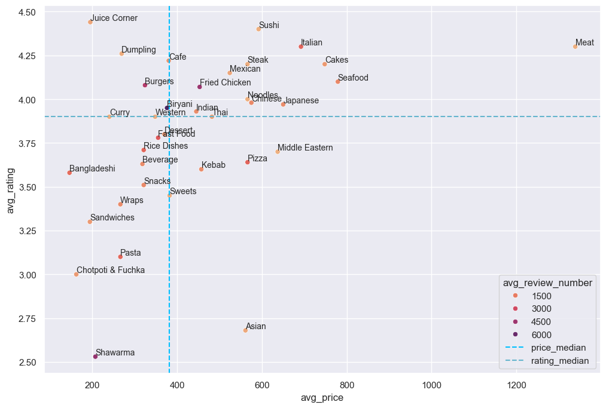
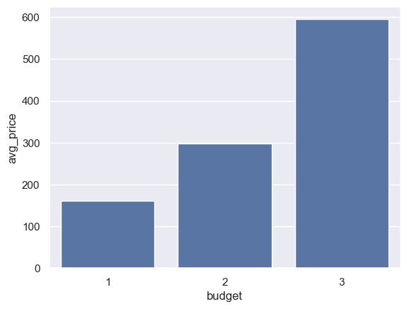
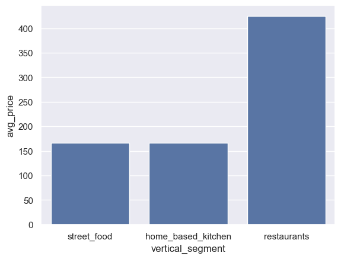
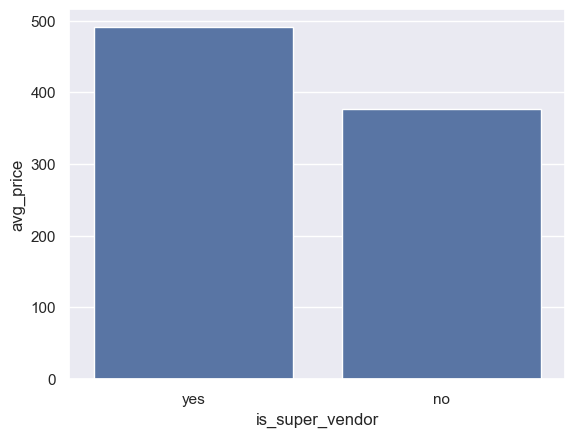
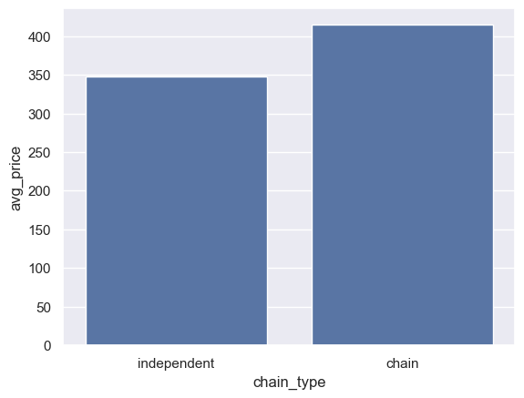
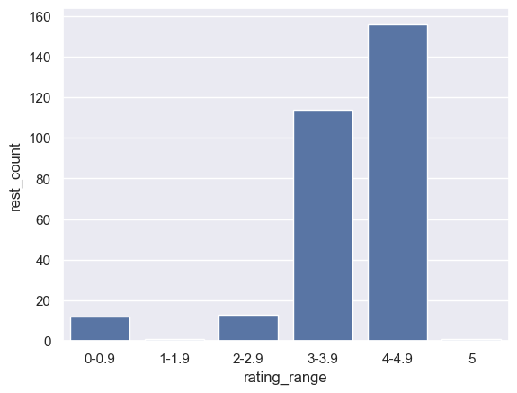
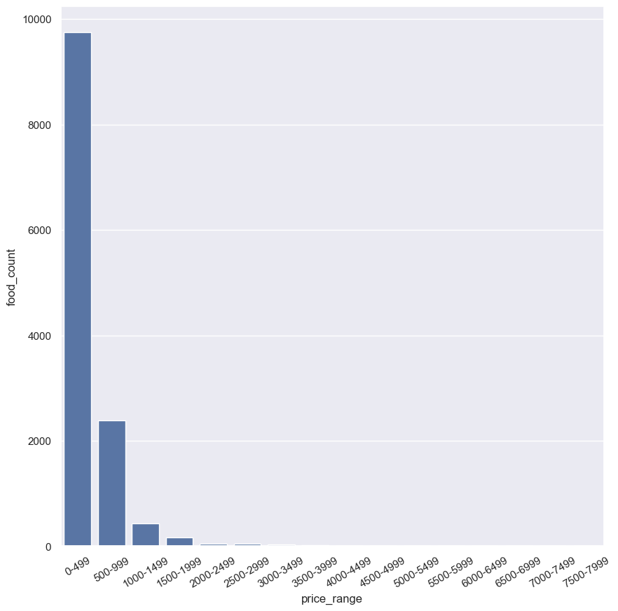
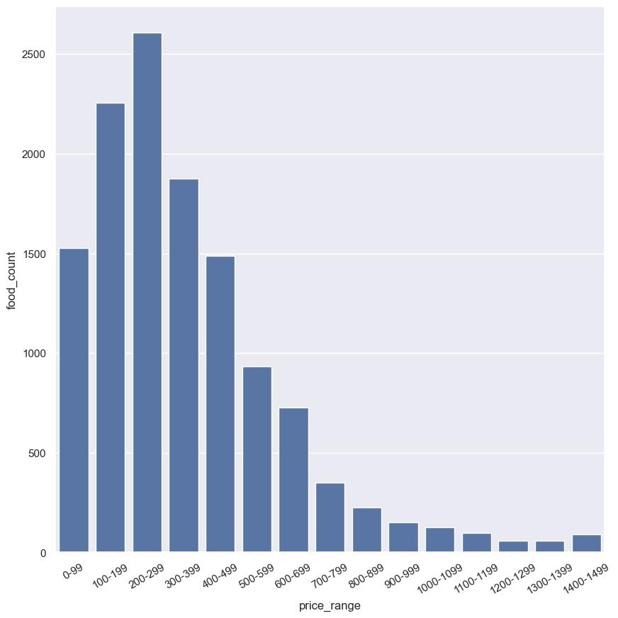

**Navigation:**

[1. Budget categories](./analysis_budget_categories.md)\
[2. Cuisines](./analysis_cuisines.md)\
[3. Pricing]()

## 3. Pricing

**Let's look at the pricing of primary cuisines.**

```sql
-- Q14
WITH q AS 
(
	SELECT
		rest.rest_code AS rest_code,
		cui.cui_name AS primary_cuisine,
		menu.food_name AS food_name,
		menu.food_id AS food_id,
		var.var_name AS var_name,
		var.price AS price
	FROM restaurant AS rest
	INNER JOIN cuisines AS cui ON rest.primary_cuisine_id = cui.cui_id
	INNER JOIN menu USING (rest_code)
	INNER JOIN variations AS var USING (food_id)
)
SELECT
	food_prices.primary_cuisine AS primary_cuisine,
	AVG(food_prices.price)::INT AS avg_price,
	MIN(food_prices.price)::INT AS min_price,
	MAX(food_prices.price)::INT AS max_price
FROM (
	SELECT
		MIN(q.rest_code) AS rest_code,
		MIN(q.primary_cuisine) AS primary_cuisine,
		MIN(q.food_name) AS food_name,
		MIN(q.price) AS price
	FROM q
	GROUP BY q.food_id
) AS food_prices
GROUP BY primary_cuisine
ORDER BY avg_price DESC;
```

Result:

| primary_cuisine   | avg_price | min_price | max_price |
| ----------------- | --------- | --------- | --------- |
| Meat              | 1339      | 219       | 2799      |
| Seafood           | 779       | 50        | 2856      |
| Cakes             | 748       | 30        | 4500      |
| Italian           | 692       | 150       | 1150      |
| Japanese          | 650       | 95        | 4750      |
| Middle Eastern    | 637       | 75        | 2780      |
| Sushi             | 592       | 50        | 2399      |
| Chinese           | 575       | 25        | 4095      |
| Steak             | 566       | 160       | 1702      |
| Pizza             | 566       | 20        | 1899      |
| Noodles           | 566       | 0         | 1550      |
| Asian             | 561       | 40        | 3500      |
| Mexican           | 524       | 60        | 3040      |
| Thai              | 482       | 129       | 1100      |
| Kebab             | 457       | 30        | 7545      |
| Fried Chicken     | 453       | 20        | 2268      |
| Indian            | 445       | 30        | 2699      |
| Sweets            | 382       | 10        | 1100      |
| Cafe              | 380       | 30        | 3995      |
| Biryani           | 376       | 20        | 2999      |
| Dessert           | 370       | 20        | 4572      |
| Fast Food         | 355       | 8         | 3380      |
| Western           | 348       | 115       | 620       |
| Burgers           | 324       | 25        | 2150      |
| Snacks            | 321       | 3         | 5299      |
| Rice Dishes       | 321       | 20        | 3500      |
| Beverage          | 318       | 40        | 900       |
| Dumpling          | 269       | 89        | 599       |
| Wraps             | 266       | 50        | 1285      |
| Pasta             | 266       | 120       | 439       |
| Curry             | 240       | 35        | 600       |
| Shawarma          | 207       | 20        | 1400      |
| Juice Corner      | 195       | 70        | 395       |
| Sandwiches        | 194       | 80        | 369       |
| Chotpoti & Fuchka | 162       | 60        | 600       |
| Bangladeshi       | 146       | 7         | 4750      |



Meat is the most expensive cuisine by a huge margin. Seafood, and cakes occupy the next 2 spots in the highest average price list. Asian, Middle Eastern, and Italian cuisines also have a higher average price.

Meat items like steak, kababs, and fried chicken occupy the next few positions. Sweet items like dessert, cafe, and sweets follow.

Items like shawarma, wraps, sandwiches, and chotpoti-fuchka have lower average prices. Bangladeshi cuisine has the lowest average price.

Kabab has the highest maximum price (Tk 7545), while sandwiches have the lowest maximum price (Tk 369). On the other hand, meat has the highest minimum price (Tk 219).

**The following graph shows how rating, avg_review_number (popularity), and pricing of primary cuisines are related:**



**Let's see the pricing of each budget segment.**

```sql
-- Q15
WITH budget_price AS
(
	SELECT
		MIN(rest.budget) AS budget,
		MIN(var.price) AS price
	FROM restaurant AS rest
	INNER JOIN menu USING (rest_code)
	INNER JOIN variations AS var USING (food_id)
	GROUP BY menu.food_id
)
SELECT
	bp.budget AS budget,
	AVG(bp.price)::INT AS avg_price,
	MIN(bp.price)::INT AS min_price,
	MAX(bp.price)::INT AS max_price
FROM budget_price AS bp
WHERE bp.price > 0
GROUP BY budget
ORDER BY budget;
```

Result:

| budget | avg_price | min_price | max_price |
| ------ | --------- | --------- | --------- |
| 1      | 161       | 3         | 5000      |
| 2      | 298       | 8         | 4750      |
| 3      | 595       | 10        | 7545      |



Average price of a food item in mid-budget restaurants (Tk 298) are twice than that of low budget restaurants (Tk 161). Similarly, average price for high budget restaurants (Tk 595) are twice than that of mid-budget restaurants.

High budget restaurant has the highest maximum price, as expected. Interestingly, low budget restaurant has higher maximum price (Tk 5000) than that of mid-budget restaurant (Tk 4750).

**Now we investigate the average pricing of vertical segments.**

```sql
-- Q16
WITH budget_price AS
(
	SELECT
		MIN(rest.vertical_segment) AS vertical_segment,
		MIN(var.price) AS price
	FROM restaurant AS rest
	INNER JOIN menu USING (rest_code)
	INNER JOIN variations AS var USING (food_id)
	GROUP BY menu.food_id
)
SELECT
	bp.vertical_segment AS vertical_segment,
	AVG(bp.price)::INT AS avg_price,
	MIN(bp.price)::INT AS min_price,
	MAX(bp.price)::INT AS max_price
FROM budget_price AS bp
WHERE bp.price > 0
GROUP BY vertical_segment;
```

Result:

| vertical_segment   | avg_price | min_price | max_price |
| ------------------ | --------- | --------- | --------- |
| street_food        | 166       | 129       | 199       |
| home_based_kitchen | 166       | 7         | 2200      |
| restaurants        | 425       | 3         | 7545      |



Average price of a food item in home kitchens and street food vendors (Tk 166)  are almost one-third to that of restaurants (Tk 425). Also, home kitchens have a maximum price of Tk 2200, indicating home kitchens are also serving expensive or big portion food items.

**We investigate how being a super vendor affects pricing.**

```sql
-- Q17
WITH budget_price AS
(
	SELECT
		MIN(CASE 
			WHEN rest.is_super_vendor THEN 'yes' ELSE 'no'
		END) AS is_super_vendor,
		MIN(var.price) AS price
	FROM restaurant AS rest
	INNER JOIN menu USING (rest_code)
	INNER JOIN variations AS var USING (food_id)
	GROUP BY menu.food_id
)
SELECT
	bp.is_super_vendor AS is_super_vendor,
	AVG(bp.price)::INT AS avg_price,
	MIN(bp.price)::INT AS min_price,
	MAX(bp.price)::INT AS max_price
FROM budget_price AS bp
WHERE bp.price > 0
GROUP BY is_super_vendor;
```

Result:

| is_super_vendor | avg_price | min_price | max_price |
| --------------- | --------- | --------- | --------- |
| yes             | 491       | 10        | 7545      |
| no              | 377       | 3         | 5299      |



**Let's verify if chain restaurants have higher pricing.**

```sql
-- Q18
WITH budget_price AS
(
	SELECT
		MIN(CASE 
			WHEN rest.chain_main_vendor_code IS NULL THEN 'independent' ELSE 'chain'
		END) AS chain_type,
		MIN(var.price) AS price
	FROM restaurant AS rest
	INNER JOIN menu USING (rest_code)
	INNER JOIN variations AS var USING (food_id)
	GROUP BY menu.food_id
)
SELECT
	bp.chain_type AS chain_type,
	AVG(bp.price)::INT AS avg_price,
	MIN(bp.price)::INT AS min_price,
	MAX(bp.price)::INT AS max_price
FROM budget_price AS bp
WHERE bp.price > 0
GROUP BY chain_type;
```

Result:

| chain_type  | avg_price | min_price | max_price |
| ----------- | --------- | --------- | --------- |
| independent | 348       | 12        | 5000      |
| chain       | 415       | 3         | 7545      |



Average food prices are 20% higher in chain restaurants than independent restaurants. Chain restaurants also have higher maximum price, as expected.

Chain restaurants not only have higher ratings, but also have higher food prices.

**Next we look at the rating distribution of the restaurants.**
```sql
-- Q19
SELECT
	FLOOR(rating) AS lbound,
	COUNT(*) AS rest_count
FROM restaurant
GROUP BY lbound
ORDER BY lbound;
```

Result:

| lbound | rest_count |
| ------ | ---------- |
| 0      | 12         |
| 1      | 1          |
| 2      | 13         |
| 3      | 114        |
| 4      | 156        |
| 5      | 1          |



The restaurant rating distribution is left skewed i.e. most restaurants have a higher rating. About half (156) of the 298 restaurants have a rating in the highest tier (4-4.9), followed by the second highest tier (3-3.9) which has one-third (114) of the total restaurants.

**We look at the food price distribution.**

```sql
-- Q20
WITH food_price AS
(
	SELECT
		menu.food_id AS food_id,
		MIN(var.price) AS price
	FROM restaurant AS rest
	INNER JOIN menu USING (rest_code)
	INNER JOIN variations AS var USING (food_id)
	GROUP BY menu.food_id
)
SELECT
	FLOOR(fp.price/500)*500 AS price_lbound,
	COUNT(*) AS food_count
FROM food_price AS fp
WHERE fp.price > 0
GROUP BY price_lbound
ORDER BY price_lbound;
```

Result:

| price_lbound | food_count |
| ------------ | ---------- |
| 0            | 9751       |
| 500          | 2388       |
| 1000         | 425        |
| 1500         | 162        |
| 2000         | 46         |
| 2500         | 49         |
| 3000         | 30         |
| 3500         | 14         |
| 4000         | 6          |
| 4500         | 8          |
| 5000         | 3          |
| 7500         | 1          |



The price distribution reveals that three-fourth (9751) of the food items are priced below Tk 500. Tk 500-1000 price range holds the remaining majority (2388) of food items. Only 5% food items are priced over Tk 1000.

**As 95% food items are priced below Tk 1000, we take a deeper look into the food price distribution in the range Tk (0-1500).**

```sql
-- Q21
WITH food_price AS
(
	SELECT
		menu.food_id AS food_id,
		MIN(var.price) AS price
	FROM restaurant AS rest
	INNER JOIN menu USING (rest_code)
	INNER JOIN variations AS var USING (food_id)
	GROUP BY menu.food_id
)
SELECT
	FLOOR(fp.price/100)*100 AS price_lbound,
	COUNT(*) AS food_count
FROM food_price AS fp
WHERE fp.price > 0 AND fp.price < 1500
GROUP BY price_lbound
ORDER BY price_lbound;
```

Result:

| price_lbound | food_count |
| ------------ | ---------- |
| 0            | 1528       |
| 100          | 2254       |
| 200          | 2607       |
| 300          | 1874       |
| 400          | 1488       |
| 500          | 934        |
| 600          | 727        |
| 700          | 350        |
| 800          | 227        |
| 900          | 150        |
| 1000         | 125        |
| 1100         | 96         |
| 1200         | 58         |
| 1300         | 57         |
| 1400         | 89         |



Upon taking a deeper look into the Tk 0-500 price range, we see that most food items are priced in the Tk 200-300 range. Tk 100-200 range holds the next majority of food items.

Tk 300-400 price range comes next, followed by Tk 0-100 and Tk 400-500 ranges, respectively.


