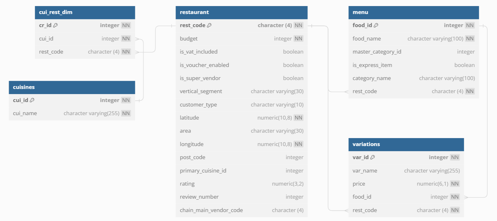

**Navigation:**

[1. Data collection (scraping)](../data_collection)\
[2. Data preprocessing](../data_preprocessing)\
[3. Data integration]()\
[4. Data analysis](../data_analysis)

## 3. Data Integration

In this process, we create a database (PostgreSQL is used here) and add the data. By utilizing a database, we are able to store data in a well-organized manner. It enables us to collect large volume data (for various locations and cities) and perform further analysis.

There are 5 tables in the database, one for each of the five CSV files from Data Preprocessing: 
`restaurant, menu, variations, cuisines, cui_rest_dim`. 

The data schema is as follows:

1. `create_tables.sql`

This SQL script contains the SQL code for creating the 5 tables `restaurant, menu, variations, cuisines, cui_rest_dim`.

2. `import_data.sql`

This SQL script contains the SQL code for importing the CSV data to the database tables created in step 1. 
Change the CSV file path as necessary.
